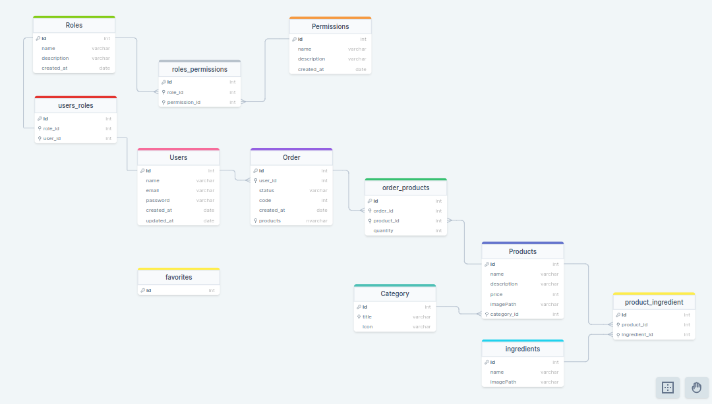

# <h1 id="top" align="center">Food**Explorer** API - Backend</h1>

<p align="center">
  <a href="#sobre">Sobre</a> &#xa0; | &#xa0;
  <a href="#gear-features">Features</a> &#xa0; | &#xa0;
  <a href="#-tecnologias">Tecnologias</a> &#xa0; | &#xa0;
  <a href="#-requisitos">Requisitos</a> &#xa0; | &#xa0;
  <a href="#checkered_flag-iniciando">Iniciando</a> &#xa0; | &#xa0;
  <a href="https://github.com/RodrigoLuigi" target="_blank">Author</a>
</p>

<br>

🔗 **Deploy** -> <a hred="https://foodexplorer-web.netlify.app/" target="_blank">https://foodexplorer-web.netlify.app/</a>

```
Login Admin
email: adm@admin.com
password: 111xxx
```

<br>

##  _**O que desenvolvemos neste Projeto?**_

📌 FoodExplorer é uma aplicação de um cardápio digital para um restaurante fictício. Uma aplicação de ponta a ponta com front-end e back-end utilizando as teconologias aprendidas no Explorer

Desenvolvemos o projeto com módulos separados para facilitar a escalabilidade e a manutenção da nossa aplicação.
O "food explorer" tem duas personas: o admin e o usuário. O admin, responsável pelo restaurante, pode criar,
visualizar, editar e apagar pratos a qualquer momento. Cada prato contém uma imagem, nome, categoria, descrição breve, ingredientes e preço. Ao adicionar um prato, o admin recebe uma mensagem de sucesso e é redirecionado para a página principal. O usuário pode visualizar todos os pratos cadastrados e obter informações mais detalhadas ao clicar em um prato específico.

Desenvolvido utilizando **Node.js** e **Express.** Criação de um banco de dados utilizando **SQLite**, e manipulação
do DataBase utilizando o **Query Builder Knex.js** e **Beekeper Studio**.

## :gear: Features

:heavy_check_mark: Cadastro de permissão de usuário\
:heavy_check_mark: Cadastro de usuário\
:heavy_check_mark: Atualizar cadastro de usuário\
:heavy_check_mark: Autenticação de usuário\
:heavy_check_mark: Cadastro de categoria\
:heavy_check_mark: Deletar categoria\
:heavy_check_mark: Editar categoria\
:heavy_check_mark: Listar categorias\
:heavy_check_mark: Listar produtos pela categoria\
:heavy_check_mark: Cadastro de ingrediente\
:heavy_check_mark: Deletar ingrediente\
:heavy_check_mark: Editar ingrediente\
:heavy_check_mark: Listar ingrediente\
:heavy_check_mark: Upload imagem do ingrediente\
:heavy_check_mark: Cadastro de produto\
:heavy_check_mark: Deletar produto\
:heavy_check_mark: Editar produto\
:heavy_check_mark: Upload imagem do produto\
:heavy_check_mark: Pesquisar produtos\
:heavy_check_mark: Listar produtos\
:heavy_check_mark: Detalhes do produto\
:heavy_check_mark: Cadastro de pedido\
:heavy_check_mark: Detalhes do pedido\
:heavy_check_mark: Listar pedidos\
:heavy_check_mark: Editar status do pedido\
:heavy_check_mark: Favoritar produto

## Diagram

<div align="center">
  
</div>

## 👨‍💻 Tecnologias

As seguintes ferramentas foram usadas neste projeto:

- [Node.js](https://nodejs.org/en/)
- [JavaScript](https://www.w3schools.com/js/default.asp)

## :books: Bibliotecas

_**As seguintes bibliotecas foram utilizadas neste projeto:**_

- [Express](https://expressjs.com/pt-br/)
- [SQLite](https://www.sqlite.org/docs.html)
- [Knex](https://knexjs.org/)
- [Cors](https://developer.mozilla.org/pt-BR/docs/Web/HTTP/CORS)
- [Bcryptjs](https://www.npmjs.com/package/bcrypt)
- [JWT - Jason Web Token](https://jwt.io/introduction)
- [Multer](https://www.npmjs.com/package/multer)
- [Dotenv](https://www.npmjs.com/package/dotenv)
- [pm2](https://pm2.keymetrics.io/docs/usage/quick-start/)
- [Jest](https://jestjs.io/pt-BR/)

## 📝 Requisitos

- [Git](https://git-scm.com)
- [Node](https://nodejs.org/en/)
- [npm](https://www.npmjs.com/)

## :checkered_flag: Iniciando

```bash
# Clone este projeto
$ git clone https://github.com/RodrigoLuigi/FoodExplorer-API.git

# Acesse o projeto
$ cd FoodExplorer-API

# Instale as dependências
$ npm install

# Inicializando Migrations
$ npm run migrate

# Inicializando projeto
$ npm start

# Inicializando projeto modo Desenvolvimento
$ npm run dev

# O Server irá inicializar em http://localhost:3333
```

## 🔗 Rotas

<div style="display: flex">

```bash
# [POST] Cadastrar usuário
/users

# [PUT] Atualizar dados do usuário
/users

# [POST] Fazer login ou Iniciar sessão
/sessions

# [GET] Listar categorias de produto
/categories

# [DELETE] Deletar categoria
/categories/:id

# [POST] Criar categoria
/categories

# [GET] Listar produtos pela categoria
/:categoriesId/products

# [POST] Criar ingrediente
/ingredients

# [DELETE] Deletar ingrediente
/ingredients/:id

# [PUT] Atualiza dados do ingrediente
/ingredients/:id

# [GET] Listar ingredientes
/ingredients

# [PATCH] Atualizar imagem do ingrediente
/ingredients/image/:id


```

```bash
# [POST] Criar produto
/products

# [DELETE] Deletar produto
/products/:id

# [PUT] Atualizar dados do produto
/products/:id

# [GET] Listar produtos
/products

# [GET] Listar produto
/products/:id

# [PATCH] Atualizar imagem do produto
/products/image/:id

# [POST] Criar pedido
/orders

# [PATCH] Atualizar status do pedido
/orders/:id

# [GET] Listar pedidos
/orders

# [GET] Listar pedido
/orders/:id

# [POST] Criar permissão
/permissions

# [POST] Criar função (ROLE_USER / ROLE_ADMIN) para atribuir ao usuário
/roles
```

</div>

&#xa0;

_**Feito por <a href="https://github.com/RodrigoLuigi" target="_blank">Rodrigo Luigi</a>**_ 👨‍🚀

<a href="#top">Back to top</a>
